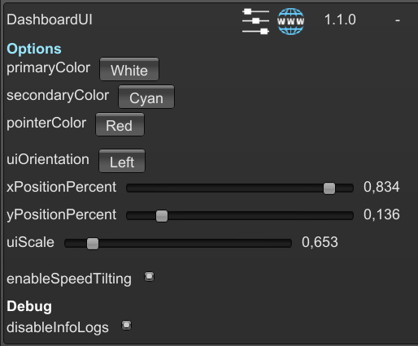

# Dashboard UI

A mod for Art of Rally which adds a rev counter and speedometer UI.

#### Launcher Support

#### Platform Support

## Usage

Press Ctrl + F10 to open the mod manager menu.\
Adjust settings to select the colors you want for the UI, its placement and its size.

By default, the mod hide's the game's RPM, gear and speed UI, and places the custom UI on the bottom left of the screen with white base, cyan rev and red pointer.

### General

- **primaryColor** : will change the color of most of the UI's elements.
- **secondaryColor** : will change the color of the rev jauge and of the gear indicator.
- **pointerColor** : will change the color of the rev needle.
- **uiOrientation** : will change the general shape of the rev counter.
- **xPositionPercent** : will move the UI horizontally.
- **yPositionPercent** : will move the UI vertically.
- **uiScale** : will change the size of the UI.
- **enableSpeedTilting** : will decide if the dashboard UI tilts with the speed of the car.

### Debug

- **disableInfoLogs** : will disable the mod's information log messages.

Disabling the mod in the manager will hide the custom UI and display the game's original UI by default.

## Available colors

The available colors for the UI are :

- White
- Grey
- Black
- Red
- Green
- Blue
- Yellow
- Magenta
- Cyan
- Brown

## Installation

Follow the [installation guide](https://www.nexusmods.com/site/mods/21/) of
the Unity Mod Manager.\
Then simply download the [latest release](https://www.nexusmods.com/artofrally/mods/14)
and drop it into the mod manager's mods page.

## Showcase

## Bonus

Want to see the damages your car has sustained while in-stage ?
You can try the Damage UI mod to display special UI representing the current state of your car's parts.

